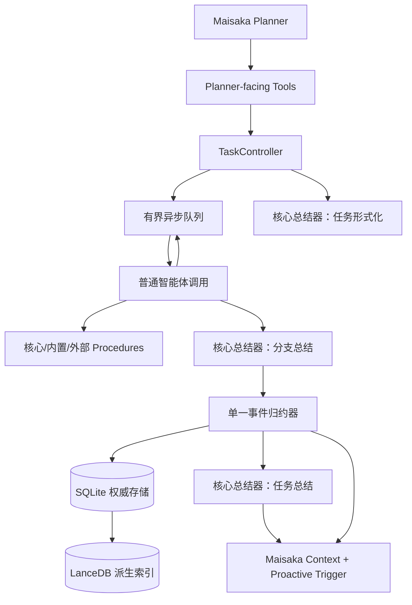

# 麦麦深度调查组（Lunagentic Research Swarm）设计规格

**日期：** 2026-08-03

**状态：** 已批准

**仓库：** `maibot-lunagentic-research-swarm/`

**插件 ID：** `com.0-hz.lunagentic-research-swarm`

**Python 包：** `lunagentic_research_swarm`

**简称：** LRS

**架构：** 中央事件归约器 + 有界异步图调度器 + 可扩展智能体/Procedure 注册表

**增补：** Procedure 研究 credits 计费与旁路承包商 `builtin.contractor` 见
`2026-08-06-contractor-procedure-design.md`（本文件相关不变量 / §9.1 / §11 / §12.2 / §15 / §25.3
已与之对齐）。Procedure 访问权（`allowed_agents`）与 prompt 表面见
`2026-08-07-procedure-access-and-prompt-surface-design.md`（§8.2 / §14 / §15 已与之对齐）。

## 1. 摘要

麦麦深度调查组是一套面向 MaiBot 的深度研究智能体蜂群。插件接收 Maisaka Planner 发起的异步调查任务，在时间提示和 credits 预算下，让多代专职智能体动态分工、调用资料检索工具、互相质疑、压缩上下文，并持续产出带统计信息的中间报告和最终结论。

英文短描述：

> An agentic research swarm for MaiBot that coordinates specialized agents, dynamic credit allocation, model routing, research procedures, and branch-aware context optimization to conduct sustained, in-depth investigations with regular reporting and auditable cost characteristics.

英文长描述：

> Lunagentic Research Swarm is an in-depth research system for MaiBot built around an agentic swarm architecture. It coordinates multiple generations of specialized agents that research, deliberate, challenge conclusions, retrieve memories, and synthesize evidence across dynamically branching investigations.
>
> Deployments can combine price-competitive fast models—such as GPT-5.6 Luna and DeepSeek-V4-Flash-0731—with large, knowledge-rich models such as GPT-5.6 Sol and Claude Opus 5 configured at reduced reasoning levels. Agents dynamically allocate credits, delegate work, select suitable specialists and models, invoke research procedures, and compact branch context as the investigation evolves.
>
> This architecture encourages useful emergent collaboration while retaining explicit resource accounting, configurable concurrency and safety limits, regular intermediate reports, and approximately predictable reporting-time and cost characteristics.

“Lunagentic”是“Luna”与“agentic”的组合词。模型名称只作为部署示例，不构成依赖或固定路由。插件本身必须兼容任何满足 MaiBot LLM 调用契约的模型。

## 2. 目标

- 接收 Planner 提供的调查目标、建议时间预算和 effort level，并立即返回唯一任务 ID，不阻塞 Planner。
- 由不可作为智能体使用的核心总结器先把上下文整理为不可变的正式任务描述。
- 让一个可配置的普通根智能体启动调查；默认使用“快速思考者”，但不把“编排器”身份写入系统提示。
- 允许所有普通智能体根据角色、已有信息、能力、剩余时间和 credits 动态调用 Procedure 或委派给任意其他普通智能体。
- 支持 JSON envelope 和原生工具调用两种协议；逐智能体配置，默认使用兼容性更好的 JSON envelope。
- 支持任务别名和物理模型名；任务别名走公开 `ctx.llm.generate`，物理模型名走隔离的内部 pinning 适配器。
- 用显式 credits 账本表达研究资源，在允许短暂透支的同时保持每一次转移和扣费可审计。
- 周期性给 Maisaka 发送中间报告；全部分支结束时发送最终结论。
- 支持暂停、继续、停止、追加信息、查询状态和提交反馈。
- 使用 SQLite 保存权威状态和总结，使用可重建的 LanceDB 索引历史案例。
- 让内置智能体和非核心 Procedure 也通过正式扩展契约加载，以验证扩展机制可用于首发版本。
- 在默认不保存智能体原始转录和 Procedure 原始 payload 的前提下实现可恢复、可观测的运行状态。

## 3. 非目标与暂缓事项

- 不修改 MaiBot Host 或 SDK；若公开能力不足，优先在插件内部隔离兼容层。
- 不通过 `@LLMProvider` 实现现有模型的物理 pinning。该路径留给未来的独立 provider 插件。
- 首发不依赖上游 LLM 请求中断。停止任务只停止本插件继续调度，并丢弃迟到结果。
- 不把核心总结器注册为智能体，也不允许根智能体或普通智能体委派给总结器。
- 不自动训练模型，不根据反馈静默重写提示词或改变路由策略。
- 不在本插件内提供任意 shell 或无限制文件系统访问。文件仓库能力由独立、可选的 Procedure provider 插件提供。
- `fetch_url` 是推荐集成而不是硬依赖；缺失时插件仍可正常加载。

## 4. 已验证的 MaiBot 能力边界

- `ctx.llm.generate` 可接收字符串或消息序列，并按任务名选择模型。
- 当前 Host 的 LLM capability 返回 prompt、completion、total、cache-hit 和 cache-miss token usage；插件优先使用这些实际值结算。
- `ctx.llm.get_available_models` 可列出任务名，但公开调用不直接选择物理模型。
- `ctx.llm.generate` 和 `generate_with_tools` 的成功结果包含实际 `model_name`；当前值对应 `ModelInfo.name`，可用于调用后的准确价格核销。
- `ctx.maisaka.context.append` 可把报告追加到 Planner 上下文。
- `ctx.maisaka.proactive.trigger` 可主动唤醒 Maisaka。
- `ctx.paths.data_dir` 是插件持久化目录。
- `ctx.api.list`、`ctx.api.call` 和动态 API 支持跨插件扩展发现与调用。
- `ctx.config.get` 公开读取 Host 的 `bot_config` 全局字段，`get_all/get_plugin` 读取插件配置；它们不能直接读取 `model_config.toml`。
- SDK 可通过 `config_reload_subscriptions = {ON_MODEL_CONFIG_RELOAD}` 订阅完整模型配置的热更新广播，但插件首次加载时不会自动收到初始模型配置快照。
- 当前 Host 没有为本场景暴露可靠的上游请求中断能力。
- 当前 `ctx.llm.generate` 结果没有向插件暴露统一 `finish_reason`，因此不能只依靠 provider 原因判断输出是否截断。
- 显式 `max_tokens` 会覆盖模型/任务配置并传给 provider；过大值可能被模型拒绝。

## 5. 核心术语与不变量

### 5.1 Task、Round、Branch 与 Turn

- **Task：** 一个稳定任务 ID 对应的长期调查记录。
- **Investigation round：** 一次从根智能体开始的调查轮次。`continue_deep_research` 可在同一 Task 下创建新 round。
- **Branch：** 从某次委派形成、拥有独立可变上下文和 credits 余额的执行分支。
- **Turn：** 某个普通智能体的一次 LLM 调用及其返回 envelope、Procedure 处理和后续委派。
- **Task pool：** 任务级休眠 credits 池。它只接收结算，不会自行重新分配。

### 5.2 强制不变量

1. 正式任务描述一经生成，在 Task 的所有 round、branch、compact 和总结中保持逐字节不变。
2. 总结器不是智能体，不出现在委派目录，不受研究 credits 限制。
3. Procedure **可以**通过结果字段 `research_credits_charged` 扣减研究 credits（缺省 / 未申报视为 0）。请求侧可选外层 `credits` 仅作预算提示，不预扣。`external_cost*` 仍只作现实费用遥测，不触碰研究余额。旁路承包商等细节见 `2026-08-06-contractor-procedure-design.md`。
4. Task pool 只有 `continue_deep_research` 能触发重新分配。
5. 零余额可以继续委派；只有负余额会触发 credits 终止。
6. 委派只能把父分支的可用余额交给子分支，不能主动从 Task pool 取款。
7. 原始上下文在分支终结后丢弃；任务重启也只使用正式任务描述、总结、报告和新信息。
8. 不保存或传递 provider 的 reasoning 字段；插件配置和协议也不定义 reasoning 字段。
9. 所有状态转移由单一事件归约器完成；并行 worker 不直接修改权威任务状态。

## 6. 总体架构



每个 Task 拥有一个 `TaskController` 和事件队列。LLM 与 Procedure worker 可以并发执行，但所有完成、扣费、结算、分支生成、状态转换和报告编号都作为事件串行提交给 reducer。这样既保留并行吞吐，也避免多个分支同时修改 pool、状态或报告造成竞态。

## 7. 任务生命周期

### 7.1 状态

- `FORMALIZING`：正在生成正式任务描述。
- `RUNNING`：正常调查。
- `REPORTING`：到达报告屏障，正在等待 grace/checkpoint/汇总。
- `PAUSING`：等待在途调用到达安全边界。
- `PAUSED`：不启动新 LLM 调用；保留内存分支。
- `FINALIZING`：所有活动叶子已结束，正在生成任务级结论。
- `COMPLETED`：正常完成。
- `COMPLETED_WITH_ERRORS`：已有可用分支结果，但任务级总结失败或部分结果不可用。
- `STOPPED`：Maisaka 或用户主动停止。
- `EXPIRED`：暂停超过超时后释放上下文。
- `INTERRUPTED`：Host/plugin 重启导致活动上下文丢失。
- `FAILED`：任务形式化或权威状态持久化等关键步骤失败。

`COMPLETED`、`COMPLETED_WITH_ERRORS`、`STOPPED`、`EXPIRED`、`INTERRUPTED`、`FAILED` 都是当前 round 的终态，但只要 Task 存在，仍可按继续规则开启新 round。

### 7.2 启动

1. `start_deep_research` 校验参数并在 SQLite 中创建 Task/round，状态为 `FORMALIZING`。
2. 工具立即返回 `task_id`、`round`、状态、有效时间预算和初始 credits，不等待总结器。
3. 形式化调用读取 Planner 目标、工具上下文、最近聊天消息、bot identity/behavior style，以及可取得的 Maisaka 上下文快照。
4. 形式化调用不提供任何智能体或工具能力，也不做 cache 优化。
5. 成功后保存并冻结正式任务描述，生成 embedding/index job。
6. 冻结本 round 的智能体和 Procedure 目录快照。
7. 创建根分支，把 100% 初始 credits 交给根智能体并启动首次调用。

### 7.3 暂停

- `pause_deep_research` 把状态改为 `PAUSING`。
- 已经在途的普通智能体调用允许结束；该 turn 请求的非 LLM Procedure 仍可执行和入账。
- 不再启动新的普通智能体调用，也不调用总结器。
- 待启动委派保留在内存边界，所有在途工作结束后进入 `PAUSED`。
- 默认暂停超时为 1200 秒，可配置。超时后进入 `EXPIRED`，丢弃未总结的原始分支上下文。
- `EXPIRED` 不自动请求反馈。

### 7.4 停止

- `stop_deep_research` 停止所有新调度，取消本地等待，并把状态记为 `STOPPED`。
- 若上游请求无法中断，已发出的 LLM 调用可能继续在 Host/provider 执行；返回结果一律按 task/round generation token 丢弃。
- 不调用分支或任务总结器，立即释放原始上下文。
- Maisaka 或用户主动停止被视为有意义的决策，会进入反馈等待流程。

### 7.5 继续或重启

- `continue_deep_research` 必须引用已存在的 Task，否则返回 `task_not_found`。
- 每次调用都重置报告时间预算。提供 `time_budget_seconds` 时更新保存的间隔；未提供时复用 Task 当前保存值。
- `credit_adjustment` 是有符号 credits，可增加或收紧预算。
- 若存在活动叶子，先建立重新分配屏障：允许在途调用结束、结算自身成本并执行已请求的普通 Procedure，然后把 Task pool 与 adjustment 一起分配给活动叶子，再进行负余额检查和子分支启动。
- 若没有活动叶子，Task 当前 round 已结束；可用余额为 Task pool 加 adjustment。余额非负时以原正式任务描述、已有总结、最终报告、反馈和新信息创建新 round/root；余额为负时返回 `task_finished_insufficient_funds`。
- 新 round 不恢复旧转录或旧 Procedure payload，避免失败调查的原始上下文污染重启。

## 8. 正式任务描述与消息结构

### 8.1 总结器的任务形式化角色

默认总结器 selector 为 `task:mid_memory`。系统提示由插件固定，明确禁止调用工具、委派智能体或自行研究，只要求：

- 消除聊天噪音和重复信息；
- 保留目标、约束、已知事实、未知点、成功标准和期望输出；
- 区分用户事实、假设和待验证内容；
- 生成独立可读的正式任务描述；
- 不把内部调度说明误写成调查结论。

形式化结果本身就是一种总结，始终保存到 SQLite 并进入向量索引。原始最近聊天和 Maisaka 快照默认不持久化。

### 8.2 Cache 友好的稳定前缀

同一 round 的普通智能体消息按以下顺序组织：

1. **System：** 整个 swarm 的共同身份与宿主风格，以及冻结的智能体/Procedure 目录（可读 Markdown：控制与研究 Procedure、可委派智能体身份卡；有实质价格数据时附模型费用参考）。目录列出本 round **全部**启用 Procedure 的定义与 arguments schema；若某 Procedure 限制可调用智能体，在定义旁注明「仅这些 `agent_id` 可调用，其他请委派」。智能体卡含 id / 名称 / 简述，不含 `character_prompt`、provider 指纹、实现层字段，也不再列出 agent 侧 Procedure allowlist。工作方式与输出协议附在 system 末尾。等价目录必须渲染为字节相同的 system 前缀以利 cache。
2. **User 1：** 不可变正式任务描述。
3. **后续消息：** 父分支全部已有消息、Procedure 结果、其他分支广播和新增信息。
4. **末尾 `[LRS runtime]` 块：** 每次普通智能体调用前追加一个，见下。

角色和 personality（`character_prompt`）随子任务分配下发，不放在 system 中。子智能体继承父智能体的完整消息序列并只追加新内容，从而在相同或共享 provider cache 的模型之间最大化前缀复用。任何 compact 都只改写可变历史，之后重新附加原样的正式任务描述。

### 8.2.1 `[LRS runtime]` 块

每次普通智能体调用前，在消息末尾追加一个 `[LRS runtime]` 用户消息，内含三部分：

- **身份：** 本智能体的 `agent_id`、显示名、职责，以及自委派时该写哪个 id；
- **任务分配：** 本分支的 `character_prompt` 与子任务（根调用则是“你是本轮起始协调者，请决定下一步委派”）。这也是 §8.2 第 3 项过去所说的 “User 2”，现与身份/状态合并为同一个块；
- **运行时状态：** 当前 branch/turn、本智能体本 turn **可调用的 Procedure ID 列表**（含 `core.*`；由 Procedure 的 `allowed_agents` 与冻结目录求交得出——冻结 system 对全轮所有智能体逐字节相同，故可调用子集只能在这里以 ID 给出，定义与 schema 仍读 system）、调用时自动计算的剩余报告时间、当前 credits（已预扣本次估算 input 后）、上一 turn 实际扣费以及活动/排队摘要。余额为负时明确告知本 turn 返回后不能启动后代；余额为 0 时明确告知仍可进行零 credits 委派。

该块不进入稳定 system 前缀。**历史只追加：** 旧的 `[LRS runtime]` 块留在原位不被删改，因此上一次请求始终是下一次请求的逐字节前缀，provider 前缀 cache 可覆盖整条链。块内声明“只有最后一个有效、更早的块已过期”，system 前缀亦重复该规则。任务分配每 turn 重新渲染进当前块，因此被 compact 重写过的分支不会丢失自己的角色与子任务。

## 9. 普通智能体协议

### 9.1 统一 envelope

所有普通智能体的内部结果先归一化为：

```json
{
  "report": "本次工作的简要说明；原生工具模式可为空字符串",
  "procedures": [
    {
      "procedure_id": "provider_namespace.procedure_name",
      "call_id": "可选；本 turn 内由智能体自定的关联 ID",
      "credits": 0.0,
      "arguments": {}
    }
  ],
  "delegations": [
    {
      "agent_id": "agent_id",
      "task": "交给子智能体的具体工作",
      "credits": 10.0
    }
  ]
}
```

- `report` 不包含 provider reasoning，但它是该智能体本 turn 的工作输出：turn 结束后
  以 assistant 消息追加进该 branch 的可变历史，因此子分支继承父节点的输出，分支
  总结 / checkpoint / compact 也以它为主要输入。
- Procedure 请求的身份字段是 `procedure_id`，与第 15.1 节 definition 同名。`call_id`
  可选，由智能体自行生成，仅原样回显在结果摘要中用于对账，不参与路由或去重；
  结果顺序始终由请求顺序决定。
- Procedure 请求的外层 `credits`（缺省 0）是交给 handler 的**预算提示**，调用前不预扣；
  实际扣费以结果 `research_credits_charged` 为准。委派边的 `credits` 仍是父子余额分配份额。
  两处 `credits` 都必须为非负数，允许为 0。
- 智能体可把自己列为下一智能体，实现“调用 Procedure 后把结果交回自己”的工具循环。
- 智能体也可同时请求 checkpoint、其他 Procedure 和多个子智能体。
- 若本 turn 执行了至少一个**非控制** Procedure（非 `core.*`），且 `delegations` 为空、未
  `terminate`、余额非负，runtime **静默注入一条自委派**（同一 `agent_id`，credits 为结算后
  剩余余额），走与显式委派相同的 `plan_delegations` / 物化规则。这是未显式自委派时的兜底，
  **不在 agent-facing prompt 中说明**；正常习惯仍应显式自委派以便阅读结果。
- 若本 turn **没有**非控制 Procedure，且没有显式委派、没有 `terminate`，仍视为自然结束，
  调用核心分支总结器（`no_further_work`）。`checkpoint` 且无委派时同样自然结束（无事可释放）。

### 9.2 JSON envelope 模式

- 默认模式，适用于所有能输出文本的模型。
- 插件先执行严格 JSON parse，再做有限、确定性的本地语法修复。
- 允许的修复：移除 BOM/空白/单一 Markdown code fence、移除无歧义 trailing comma、从无歧义包装文字中提取唯一顶层对象。
- 不允许补字段、改字段名、猜测类型、在多个对象中选择、补齐疑似截断内容或改变任务文本。
- 修复后仍必须通过完整 schema；成功修复记录 `protocol_repaired=true` 和具体规则。

若本地修复失败或 schema 不合法：

1. 保留该畸形 assistant 消息在当前内存上下文中；
2. 追加一个 user 消息，列出 JSON Pointer/schema 错误和最小正确格式；
3. 在余额不为负的前提下，用同一 agent、同一模型、同一协议再调用一次；
4. 这不是 provider retry，而是正常递归 turn，计入调用次数并扣 credits；
5. 默认最多一次，可配置；再次失败即以 `protocol_invalid` 终止并调用分支总结器。

### 9.3 原生工具模式

逐智能体可设置 `protocol = "native_tools"`。插件只提供一个合成函数：

```text
submit_swarm_turn(report, procedures, delegations)
```

整个 envelope 都放在函数参数中，assistant 文本是可选补充，不能成为必需字段。这兼容“调用工具时无法同时输出正文”的模型。参数若以 JSON 字符串形式出现，可使用同一有限修复流程；字段/schema 错误使用同一追加错误消息、同模型一次递归纠正策略。

插件不对普通 HTTP 状态、provider 返回码或传输失败进行自己的 LLM retry；这些由 MaiBot Host 负责。

## 10. Turn 处理顺序与分支图

普通智能体调用完成后严格按以下顺序处理：

1. 验证 generation token，停止或换 round 后到达的旧结果直接丢弃。
2. 用 Host usage 对启动时的输入预扣进行核销，再扣实际输出费用。
3. 解析、有限修复并验证 envelope；必要时执行一次协议纠正 turn。
4. 执行本 turn 请求的普通 Procedure；同一 turn 内可在并发上限内并行。
5. 若存在待处理的 `continue_deep_research`，进入重新分配屏障并完成 pool 分配。
6. 执行 `compact`，并识别 `terminate` / `checkpoint` 控制请求。
7. 若 `terminate` 已请求，忽略 checkpoint 和所有委派，最终总结当前分支。
8. 否则若余额为负，忽略 checkpoint 和所有委派，并按 credits 原因最终总结当前分支。
9. 否则若请求 `checkpoint`，立即生成 checkpoint summary，把委派暂存到下一个报告时间点。
10. 否则根据父分支余额缩放并创建子分支；零余额委派仍正常创建。
11. 未请求任何委派时：若本 turn 已执行非控制 Procedure 且余额非负，则静默注入自委派一次
    （同 agent、剩余 credits；不在 agent prompt 中宣传），再按步骤 10/12 物化；否则自然结束并调用分支总结器。
12. 父 turn 的未分配余额或终结余额结算到 Task pool，父节点不再活动。

Procedure 先执行、credits 终止后检查这一顺序是强制规则。这样即使模型估算错误导致本 turn 结束后变成负余额，它已经请求的搜索、计算或资料读取仍会完成并进入最终总结，但不会继续生成新的普通智能体调用。

本 turn 的 `report` 与普通 Procedure 结果按请求顺序确定性地加入父 branch 上下文；随后创建的所有子 branch 都继承它们。若智能体希望自己理解结果，就把自己作为一个子委派目标；若忘记填写委派但已调用非控制 Procedure，runtime 会代为自委派一次。鼓励同一 envelope 内并行发出多条 procedure 与多条委派。

若某个 turn 请求了委派，但每一条委派边都被拒绝（目标 agent 已被移除、超过分支深度或超过 Task 调用上限），则不会产生任何子分支来推进该 branch。此时分配给这些边的 credits 全额留在父分支：

- 原因可能在下一 turn 改变（`agent_unavailable`）时，把全部失败原因作为 user 消息追加给父分支并重试父节点一次，该重试计入 `max_agent_calls_per_task`；
- 原因是确定性的（`branch_depth_exceeded`、`agent_call_limit_exceeded`）时，直接按该原因最终总结父分支。

父节点绝不允许在没有任何待执行工作的情况下留在活动叶子集合中。

### 10.1 控制 Procedure

- **`terminate`：** 主动结束当前分支。与其他 Procedure 同时请求时，其他普通 Procedure 可先完成；同一 envelope 中的 `compact` 仍先执行，因此分支最终总结运行在压缩后的历史上；`checkpoint` 与所有委派忽略。
- **`compact`：** 使用核心总结器压缩当前分支的可变历史。可与普通 Procedure 和委派同时请求；压缩在普通 Procedure 结果进入上下文后、子分支 clone 前完成，因此所有新子分支继承压缩后的父上下文。
- **`checkpoint`：** 调用“分支总结”角色，生成不终止原分支的阶段性总结。总结广播给其他活动分支；当前 envelope 的委派先暂存，branch 等到下一报告时间点再继续。若已经处于 grace，则 summary 完成后即可继续。checkpoint 本身不产生待执行工作：同一 envelope 没有委派时按第 9.1 节的自然结束处理，直接最终总结该分支，而不是把它挂在一个无事可释放的 epoch 边界上。

  释放暂存委派就是那次被推迟的委派，因此与普通委派共用同一套判定，不得另起一套：结构上限（`max_delegations_per_turn`、`max_branch_depth`、`max_agent_calls_per_task`）、目标 agent 存活性检查、父子 credits 比例缩放，以及“被拒绝的边不参与分配”的守恒规则全部相同；被拒绝的边同样以对应原因终结，全部被拒时走第 10 节的恢复路径。释放后按第 10 节步骤 12 让父节点退休并把未分配余额结算到 Task pool，因此父节点对 `{parent}:{n}` 子分支 ID 空间只使用一次。

调度器为报告自动生成的 checkpoint 与智能体主动 Procedure 不同：自动 checkpoint clone 稳定上下文后，原 branch 立即继续，不进入等待状态。总结器本身仍不是可委派智能体。

## 11. Credits 与成本账本

### 11.1 单位

模型配置价格数值的 `1.0` 始终等于 100 credits。插件忽略配置界面可能标注的人民币、美元、加元、欧元或日元等货币名称，只把数值转换为内部 credits。

默认基础 effort budget 为 100 credits。初始预算为：

```text
initial_credits = default_effort_credits × effort_level
```

`effort_level` 默认 1.0，启动时必须为非负有限数。

### 11.2 Token 成本

```text
miss_cost   = miss_input_tokens / 1_000_000 × input_price × 100
hit_cost    = hit_input_tokens  / 1_000_000 × cached_input_price × 100
output_cost = output_tokens     / 1_000_000 × output_price × 100
call_cost   = miss_cost + hit_cost + output_cost
```

- 优先使用 Host 返回的实际 cache-hit/cache-miss/input/output usage。
- 启动调用时先根据消息和 cache lineage 估算 input，立即从该分支预扣；不做余额门槛检查。
- 返回后用实际 input 核销预扣，并扣实际 output。
- 若调用失败且没有 usage，保留估算 input 扣款并标记 `estimated_unreconciled`；没有证据时不虚构 output token。
- 若某调用路径没有 usage 能力，则使用明确标记的 estimator，而不是把估算值伪装成实际值。

价格 profile 按物理模型的 `ModelInfo.name` 解析，优先级如下：

1. LRS 插件配置中的该模型完整 override；
2. Host `model_config.toml` 中该模型的 `price_in`、`cache`、`cache_price_in`、`price_out`；
3. 找不到模型、价格字段缺失或无法读取 Host 配置时，沿用 Host 默认行为，完整 profile 按 0 计算，即视为免费。

只要用户为某物理模型建立 LRS price override，该 profile 就完全忽略 Host 中同一模型的实际价格。override 条目中省略的数字字段按 0、`cache` 按 false，因此它始终是一个完整 profile。WebUI 和文档必须突出显示这一点；不能把 Host 与插件字段逐项混合。

初次加载时，LRS 通过与 physical pinning 相同的隔离 Host-internal adapter 读取 Host 已验证的内存 `model_config`，不直接依赖相对路径解析原始 TOML。读取失败不阻止插件加载，价格按 0，并在 health/ledger 的 `price_source` 标记为 `host_unavailable_free`。插件声明 `ON_MODEL_CONFIG_RELOAD` 订阅；之后由公开 `on_config_update(scope="model", config_data=...)` 更新内存价格和 task model-list 快照。

模型配置广播可能同时包含 provider credentials。LRS 只抽取模型 `name/price_in/cache/cache_price_in/price_out` 和 task `model_list` 等必要字段，构建最小内存快照后立即丢弃原始 config_data；绝不记录、日志输出或写入数据库中的 `api_providers`、API key、base URL 或其他认证字段。

`cache=false` 时，全部 prompt tokens 按 `price_in`；`cache=true` 时，cache-hit 按 `cache_price_in`、cache-miss 按 `price_in`，与 Host 当前统计逻辑一致。

对于 `task:` selector：

- 启动前的 input 预扣和低预算估算使用 task `model_list` 的第一个模型；不尝试预测 random/round-robin/fallback 的实际选择。
- 调用成功后读取返回的实际 `model_name`，使用该物理模型最终核销本次完整 input/cache/output cost。
- 若结果没有实际模型名，则继续使用启动时的第一个模型，并把结算标记为 estimated。

对于 `model:` selector，启动估算和最终核销都使用该物理模型；内部 adapter 仍把实际返回名写入统一结果。

每个 usage/ledger entry 保存 `estimated_model_name`、`actual_model_name`、`price_source`、price profile fingerprint、估算扣款、实际核销差额和是否 estimated，确保价格覆盖和 task 模型切换可审计。

### 11.3 低预算警告

插件加载时，以及每次任务启动时，估算根智能体处理 500k cache-miss input 与 50k output 的费用：

```text
warning_threshold = 50 × input_price + 5 × output_price
```

若有效初始预算低于阈值，发出“credits 可能不足以正常运行”的明确警告，但不拒绝启动。`task:` selector 对应多个物理模型时只使用 `model_list` 第一个模型的价格估算。价格为 0 时阈值也为 0，不产生低预算警告，但 health 会显示该模型的 `price_source`。

### 11.4 父子分配

根智能体获得 100% 初始 credits。每个普通智能体先承担自己的输入和输出成本，再从剩余余额 `R` 分配给子智能体。

设请求的非负分配为 `q₁…qₙ`：

- `R > 0` 且 `Σq ≤ R`：按请求值启动，`R - Σq` 结算到 Task pool。
- `R > 0` 且 `Σq > R`：按比例缩放，`aᵢ = qᵢ × R / Σq`，不从 Task pool 补足。
- `R = 0`：所有请求分配缩放为 0，但子智能体仍会启动。
- `R < 0`：普通 Procedure 完成后触发 credits 终止，不启动子智能体。

例如，余额 2 的分支请求 `2、1、1`，实际子分配为 `1、0.5、0.5`。余额 1 的分支可请求 8 个各 0.1 credits 的子智能体，0.2 credits 回到 pool；若每个子智能体实际成本 5 credits，它们都会在调用后负余额终止，总计约 -40 credits 结算，使 pool 形成约 -39.8 credits 的债务。这是允许且预期的行为。

向零成本模型分配 0 credits 也有意义：它可以正常工作或继续把 0 credits 传给后代；一旦后代产生非零成本，该后代在调用后变负并终止。

### 11.5 Task pool

- 父节点未分配余额和每个终结分支的最终余额，无论正负，都按原数值加到 Task pool。
- pool 是休眠账本，正余额不会自动救助分支，负债也不会自动削减分支。
- 负分支结算绝不自动触发重新分配。
- 只有 `continue_deep_research` 能激活整个 pool。

### 11.6 重新分配

活动叶子存在时：

1. 可分配总额为 `task_pool + credit_adjustment`；pool 随后清零并留下审计事件。
2. 以每个活动叶子的正余额为权重分配；余额越多，获得或承担的 adjustment 越多。
3. 若没有任何正余额叶子，则在所有活动叶子间平均分配，包括可能正等待 credits 检查的非正余额叶子。
4. 总额为负时使用完全相同的数学，只是各余额被减少。
5. 分配发生在 agent call/Procedure 完成后、负余额检查和子分支启动前；因此重新分配可救回一个暂时负余额叶子，也可把零/正余额叶子压成负数并触发总结。

没有活动叶子时，继续调用不会把 pool 留在“未结算”状态，而是按第 7.5 节决定是否启动新 round/root。

### 11.7 账本不变量

每个 reducer 事件后验证：

```text
initial credits
+ signed continue adjustments
- charged ordinary-agent call costs
= active branch balances
+ dormant task-pool balance
```

分配只是转移，不能制造 credits。总结器（含自动 compact）的 token / cost-equivalent 仍在研究 credits 等式之外。
普通 Procedure 若申报 `research_credits_charged`，则该金额进入研究余额扣减（与 LLM turn 扣费同属研究账本）；
未申报视为 0。`external_cost*` 现实费用继续只作遥测，不进入研究 credits 等式。

## 12. 核心总结器

总结器是插件拥有的 LLM 服务，不是智能体。它不能成为 root，不能被委派，也不拥有 credits。它使用四套由插件固定的系统提示：

1. **`formalize_task`：** 从 Planner 目标、最近聊天和可用 Maisaka 上下文生成正式任务描述。
2. **`finalize_branch`：** 从一个 branch/checkpoint 的历史生成该分支特有的结论、证据、意见、风险和未决问题。
3. **`finalize_task`：** 从正式任务描述和多个分支总结生成任务级综合结论。
4. **`compact_branch`：** 把分支的可变历史压缩成可继续工作的上下文，不改写正式任务描述。

四种模式都把正式任务描述视为不可变参考，提示词明确禁止生成“改写后的任务描述”去替换它；插件也从结构上把任务描述与可总结历史分开存放。

建议选择低温度、低幻觉、低成本、长上下文、输出稳定的模型。默认 selector 为 `task:mid_memory`。

### 12.1 `max_tokens`

- `summarizer.max_tokens = 0` 表示不向调用传实际 `max_tokens`，继承 MaiBot 模型/任务配置。
- 用户可显式设置正整数上限；已知物理模型输出上限时不得超过该上限。
- `max_tokens` 是输出 ceiling，不是目标长度。到达 ceiling 通常会返回截断结果而不是无结果异常，但 provider 行为并不统一。
- 由于当前 capability 不暴露统一 `finish_reason`，插件必须验证总结结构和完整性；不得假定一次返回必然完整。
- 各角色用提示词给出软长度目标，不使用强制 65536 默认值。

### 12.2 自动 compact

- 默认当某个 branch 的下一次估算 input 达到 258,000 tokens 时自动触发 `compact_branch`。
- 阈值可全局配置，也可逐目标 agent 覆盖；每个 branch 独立判断。
- 有模型 context window 信息时，有效阈值取全局值、agent override 和 `context_window - reserved_output - safety_margin` 的最小值。
- fan-out 时先 clone 父上下文，再按每个目标 agent 的阈值判断；手动 compact 则发生在 clone 前，影响所有子分支。
- compact 结果只替换可变历史，正式任务描述重新原样附加，因此仍能继承 root 或直接父节点的稳定 cache 前缀。
- compact 会重写分支消息并从该点打断旧 cache lineage，因此它是 Procedure，而不是可复用父前缀的普通 agent call。
- **自动** compact 不扣研究 credits，但记录 token 和 cost-equivalent。
- **智能体请求的** `core.compact` 经 `research_credits_charged` 按总结器用量扣研究 credits（即使外层 `credits` 预算为 0 也须跑完并事后扣费）。
- compact 成功后旧可变上下文立即释放。compact 结果不是案例总结，默认不写入向量索引。
- 若不可变 system/catalog/task 本身已经超过安全 context window，显式报错并终止相关分支，不能通过改写任务描述掩盖。

## 13. 时间预算、中间报告与最终报告

### 13.1 时间预算语义

时间预算是 Maisaka 希望多久收到一次结果的提示，不是停止研究的硬期限。默认 120 秒，可配置。每次中间报告发出后重新计时；`continue_deep_research` 也重新计时。

每个报告周期有递增的 `report_epoch` 和一组需要被本次报告覆盖的活动 branch frontier。已最终结束的 branch 不需要重复 checkpoint，但其 terminal summary 会继续进入所有后续中间报告和最终报告。

#### 智能体主动 checkpoint

普通智能体可在任意 turn 请求 `checkpoint`：

1. 该 turn 的普通 Procedure 先完成；
2. 核心总结器立即对当前 branch 生成 checkpoint summary；
3. 同一 envelope 中请求的 child delegations 暂存，不启动新的 child LLM；
4. branch 进入 `WAITING_REPORT_WITH_CHECKPOINT`，直到下一个报告时间点；
5. checkpoint summary 立即持久化并广播给其他活动 branch。

到达下一个 grace period 时，该 branch 已经完成本 epoch 的报告覆盖，会立即释放暂存委派并继续运行，不必再次 checkpoint。若 checkpoint 正好在 grace 中请求，则 summary 完成后即可继续。

如果报告截止时间尚未到，但当前所有活动 branch 都已经得到本 epoch 的 checkpoint summary（或明确的 checkpoint failure），或者已经 finalized 并得到 terminal summary，则不继续空等剩余时间：

- 只要仍有活动 branch，立即开始中间报告，并恢复所有等待报告的 branch；
- 若所有 branch 都 finalized，立即开始最终报告。

#### 到达报告时间与 60 秒 grace

到达时间预算时冻结本 epoch 的 frontier 并进入默认 60 秒 grace period。普通研究不建立全局暂停屏障：

1. 已有预生成 checkpoint 的 branch 立即恢复并继续其暂存委派；它的预生成 summary 已覆盖本 epoch。
2. 其他在途 agent call 正常继续。
3. grace 中任一 agent 返回后，先完成协议验证和该 turn 请求的普通 Procedure，然后立即 clone 该 branch 的稳定上下文并优先启动 checkpoint summary，不要求模型自主请求 `checkpoint`。
4. clone 后原 branch 正常处理 compact/terminate/credits 和下一步委派；checkpoint summary 与原 branch 后续工作可以并行。
5. agent 若在 grace 中 finalized，则 terminal summary 直接满足该 frontier branch 的覆盖要求，不再生成 checkpoint。
6. clone 后新产生的 child 工作属于下一报告 epoch，不扩大当前已经冻结的 frontier。

只要冻结 frontier 的所有 branch summary 已经成功生成或明确失败，就立即提前结束 grace，不等待满 60 秒，并开始任务级中间综合。若 60 秒到期仍有 agent 没返回，则从该 branch 最后一个已提交的稳定上下文 clone 并启动 checkpoint；迟到的在途结果继续原 branch，属于下一 epoch。任务级综合等待这些 checkpoint 成功或明确失败后开始。

checkpoint 失败时，中间报告明确标记该 branch 暂不可用；原 branch 不终止。若没有任何可用 summary，则只发送插件生成的进度/错误状态，不让 LLM 凭空生成调查结论。

### 13.2 报告输入集合与类型判定

每次任务级综合使用一个冻结的 coverage summary set，而不是只使用本次 grace 新产生的结果：

- 包含所有已经 finalized 的 branch terminal summary，包括在更早报告周期就 finalized 的 branch；
- 对每个仍活动的 frontier branch，包含为本 epoch 预生成或自动 clone 的最新 checkpoint summary；
- 同一 branch 更旧、已被新 checkpoint 或 terminal summary 取代的 checkpoint 仍保存在数据库中，但不重复输入本次综合；
- 所有选中 summary 都带 branch ID、summary type、report epoch、生成时间和是否 terminal，并按时间顺序作为独立 assistant 消息传入。

报告类型只由本次综合真正使用的输入快照决定：

- 只要使用了任意 clone/checkpoint summary，或仍存在活动 branch，本次一定是 **中间报告**；
- 只有所有 branch 都已 finalized，且综合输入全部是 terminal summaries 时，才能生成 **最终报告**；
- report type 在任务级总结调用开始前冻结。若中间报告生成期间剩余 branch 又全部结束，该报告仍是中间报告，随后另行使用全 terminal summary set 生成最终报告，不能把已使用 checkpoint 的报告“升级”为最终报告。

coverage set 只有一个 summary 时可直接使用其正文；有多个时调用 `finalize_task` 对应的中间或最终变体，并始终附上不可变正式任务描述。该汇总不扣研究 credits。

### 13.3 中间报告内容

中间报告必须由插件明确标记为“中间报告”，并包含：

- task ID、round、report sequence；
- 当前正式任务描述的引用或简短标题；
- 已完成分支/checkpoint 的总结；
- 活动 branch 数、在途 LLM 数、排队调用数；
- 已用时间、下一报告间隔；
- 当前活动余额与 dormant pool；
- token、cache hit/miss、credits 和失败概况；
- 当前仍在运行的子智能体数量和主要未决工作。

### 13.4 最终结论

- 所有活动叶子都已最终总结时，任务立即进入 `FINALIZING`，不等待当前时间预算结束。
- 只有一个终结分支总结时，直接把它作为结论正文，不额外调用任务总结器。
- 有多个终结分支总结时，把正式任务描述和所有 terminal summaries（包括更早报告周期已终结的 branch）作为按时间排序的独立 assistant 消息交给 `finalize_task`；历史 checkpoint 不进入最终报告输入。
- 最终结论明确标记为“最终报告”，追加到 Maisaka context 并主动触发 Planner。
- 任务级总结失败时，把已有分支总结原样、有序地报告，并把状态设为 `COMPLETED_WITH_ERRORS`，不伪造综合结论。

所有统计区块由插件确定性生成，不能让 LLM 猜测。至少包括：普通智能体调用数、Procedure 次数、分支数、最大深度、compact/checkpoint 次数、协议修复、失败数、token/cache usage、研究 credits、总结器 cost-equivalent、现实 Procedure 费用、耗时、继续次数和最终 pool。

### 13.5 总结广播

分支终结总结和 checkpoint 总结按生成时间广播给所有仍活动 branch，只在它们的下一次调用中追加，不中断在途调用。分支最终总结成功写入 SQLite 后，原 branch 上下文立即丢弃；已经从旧上下文 fork 出去的兄弟分支保留自己的引用。

## 14. 智能体扩展机制

### 14.1 核心与扩展边界

核心只包含 scheduler、reducer、总结器服务、credits/usage 账本、`compact`、`checkpoint` 和 `terminate`。根智能体也是普通可配置智能体，不是硬编码编排器。

插件要能运行必须满足：

- 有一个有效的核心总结器 selector；
- 至少有一个启用、可调用且允许成为 root 的普通智能体；
- 配置的 `root_agent` 指向该智能体。

快速思考者只是默认 root，可以被用户或第三方智能体替换。除总结器外，所有首发默认智能体都通过同一个 registry/validation 接口加载。

### 14.2 Agent definition

归一化定义至少包含：

```json
{
  "agent_id": "provider_namespace.agent_name",
  "version": "1",
  "display_name": "名称",
  "description": "能力和边界",
  "character_prompt": "本智能体的角色与工作偏好",
  "model_selector": "task:utils",
  "protocol": "json_envelope",
  "allowed_procedures": ["*"],
  "can_be_root": true,
  "auto_compact_tokens": null,
  "enabled": true
}
```

不定义 reasoning 字段。可选字段缺失时使用插件记录在 schema 中的安全默认值；显式非法值不能被静默替换。

`allowed_procedures` 保留以兼容第三方定义，**不再用于执行裁决或 system 智能体卡**。可调用集由 Procedure 的 `allowed_agents` 决定（见 §15.1 与 `2026-08-07-procedure-access-and-prompt-surface-design.md`）。内置智能体统一写 `["*"]`。

验证规则包括：

- ID/版本格式、命名空间和长度；
- 禁止冒充 core/summarizer ID；
- selector 必须是显式 `task:` 或 `model:` 格式；
- protocol 只能是 `json_envelope` 或 `native_tools`；
- prompt/catalog 字段的大小上限；
- `allowed_procedures` 语法合法（`*` 或 Procedure ID，不与混用）；
- compact threshold 和布尔字段类型；
- root 权限和启用状态。

无效扩展被拒绝并出现在 health 中；不得以默认值掩盖显式错误。

### 14.3 第三方智能体插件

配置保存在提供方插件自己的 `config.toml`。提供方通过公开 API 暴露：

```python
@API(
    "describe_agents",
    version="1",
    public=True,
    lunagentic_extension="agents",
    lunagentic_contract="1",
)
```

LRS 通过 `ctx.api.list()` 扫描带 metadata 的 API，再用完整的 `plugin_id.describe_agents@1` 拉取定义。扫描发生在：

- 插件加载；
- 新 Task/new round 启动；
- 显式 refresh；
- 可配置的周期 refresh。

LRS 另提供可选 `refresh_extensions@1` API，刚加载的扩展可以请求 LRS 重新扫描，但不能向 LRS 推入常驻对象。这样卸载或禁用提供方后，定义自然消失。

每个 round 冻结目录定义和 fingerprint，以保持 system/cache 前缀稳定。新增或修改定义默认在下一个 round 生效；删除立即影响新的调用边：

- 已经在途的目标 agent 调用允许完成。
- 返回后若它委派给仍存在的有效 agent，正常继续。
- 若它委派给自己，而自己已经被移除，或任何 branch 请求不存在的 agent，该委派边以 `agent_unavailable` 终结，把原因追加到最后消息并调用核心分支总结器。
- 同一 envelope 中其他有效委派不受影响。

### 14.4 首发默认智能体

| 智能体 | 默认 selector | 默认启用 | 重点 |
|---|---|---:|---|
| 快速思考者 / Quick Thinker | `task:utils` | 是 | 默认 root，快速拆分问题、动态委派和收敛路线 |
| 深度思考者 / Deep Thinker | `task:planner` | 是 | 复杂推理、长期规划与综合约束（运维可选更大/高思考模型，不进 agent-facing description） |
| 辩手 / Debater | `task:replyer` | 是 | 质疑前提、提供第二意见、寻找反例和风险 |
| 外部研究员 / Researcher | `task:utils` | 是 | 设计搜索词、选择搜索引擎、要求外部证据 |
| 记忆研究员 / Memory Researcher | `task:mid_memory` | 是 | 专职记忆族 Procedure；设计聊天/消息/人物/知识库查询，不负责过度解释原始结果 |
| 知识报告员 / Knowledge Reporter | `task:replyer` | 是 | 低 deliberation 地报告模型已知知识和不确定性 |
| 历史案例研究员 / Past-case Researcher | `task:utils` | 是 | 专职 `past_cases`；查询相似任务、历史决定、反馈和真实结果 |
| 证据核验员 / Evidence Verifier | `task:planner` | 是 | 交叉验证引用、识别来源冲突、区分事实与推断 |
| 定量分析员 / Quantitative Analyst | `task:planner` | 是 | 计算、比较数量级、检查数值假设和成本收益 |

这些定义、角色 prompt 和启用状态均从内置 extension 目录加载，而不是写死在 scheduler。

## 15. Procedure 扩展机制

### 15.1 统一定义

Procedure definition 至少包括：

```json
{
  "procedure_id": "provider_namespace.procedure_name",
  "version": "1",
  "display_name": "名称",
  "description": "面向智能体的能力说明",
  "arguments_schema": {"type": "object"},
  "result_schema": {"type": "object"},
  "idempotent": true,
  "timeout_seconds": 30,
  "external_cost_kind": "none",
  "allowed_agents": ["*"],
  "enabled": true
}
```

- `timeout_seconds` 允许为 `0`，表示禁用执行器硬超时（`asyncio.wait_for`）；`>0` 时仍为硬上限。
  配置 override 同样允许 `0`。内置 `builtin.contractor` 默认定义为 `0`。
- `allowed_agents` 默认 `["*"]`（本 round 全体启用智能体可调用）。非通配时为显式 `agent_id` 列表（不得与 `*` 混用）；执行与 `[LRS runtime]` ID 列表按该字段求交。首发：记忆族六项仅 `builtin.memory_researcher`；`builtin.past_cases` 仅 `builtin.past_case_researcher`；其余内置与默认 add-on（含 `fetch_url.fetch`）为 `*`。

所有结果归一化为：

```json
{
  "success": true,
  "data": {},
  "error": null,
  "research_credits_charged": 0.0,
  "metadata": {
    "provider_plugin_id": "...",
    "duration_ms": 0,
    "provenance": [],
    "external_cost": null
  }
}
```

- `research_credits_charged` 为非负有限数，缺省 `0`。runtime 在 invoke 返回后对调用分支执行
  `balance -= research_credits_charged`（允许余额为负）；无效 / 缺失按 `0` 处理。
- `metadata.external_cost` 仍只服务现实费用遥测与统计，不改研究余额。

调用都携带 `request_id`、task/round/branch/turn ID、调用 agent ID 和经过最小化的 scoped metadata
（含 `credit_budget` 预算提示，以及承包商所需的 `caller_protocol` / `caller_agent_id` 等）。
Procedure 默认无权读取其他 branch 原始上下文。

### 15.2 第三方 Procedure provider

提供方公开两个 versioned API：

- `describe_procedures@1`：带 `lunagentic_extension="procedures"` metadata，返回定义。
- `invoke_procedure@1`：接收 `procedure_id`、`request_id`、arguments 和 scoped metadata，返回统一结果。

LRS 始终使用完整 `plugin_id.api_name@version` 调用。提供方配置和 secrets 只留在提供方插件。定义失效时新调用返回结构化 `procedure_unavailable`，普通分支不会因此自动终止；错误会进入下一智能体上下文。

只有 provider 明确声明 `idempotent=true` 时，LRS 才可对 Procedure 的明确可重试失败进行有限重试。超时后无法确认是否执行的非幂等 Procedure 不自动重试。

### 15.3 首发核心 Procedure

- `compact`：核心总结器压缩 branch。自动触发不扣研究 credits；智能体请求的
  `core.compact` 经 `research_credits_charged` 计费（见 §12.2）。
- `checkpoint`：生成阶段性分支总结但保留 branch（不扣研究 credits）。
- `terminate`：最终结束 branch，忽略委派（不扣研究 credits）。

### 15.4 首发内置 Procedure

| 类别 | Procedure | 默认可调用 |
|---|---|---|
| 消息与记忆 | 查询/搜索 `ctx.chat`、`ctx.message`、`ctx.person`、`ctx.knowledge` | 仅记忆研究员 |
| Web 搜索 | 统一搜索接口，显式选择已配置的 SearXNG、Tavily、You 或 DuckDuckGo | 全体 |
| 历史案例 | 从 SQLite/LanceDB 检索相似正式任务、分支总结、最终报告和反馈 lessons | 仅历史案例研究员 |
| 分析辅助 | 安全 calculator、基础统计和单位换算 | 全体 |
| 来源处理 | URL 标准化、去重、来源/provenance 整理 | 全体 |
| 旁路承包商 | `builtin.contractor`：以目录中另一智能体作 outsider 工具（新鲜上下文、无子委派扇出、可计费）；细则见 `2026-08-06-contractor-procedure-design.md` | 全体 |

Web 搜索由 LRS 内部实现，API keys 和 SearXNG instance 由用户配置。返回结果必须保留 engine、query、URL、标题、摘要、时间和错误，不得把无来源摘要冒充网页事实。

只有已正确配置的搜索引擎才进入本 round 的 Procedure 目录；研究员可以选择不搜索。没有任何引擎时插件不伪造默认引擎，只在 health 和调用错误中明确说明不可用。

### 15.5 推荐的可选 provider

#### fetch-url

`maibot-fetch-url-plugin` 是推荐依赖，不写入硬依赖。建议在保留现有 `fetch_url@1` API 的同时增加 `describe_procedures@1` 和 `invoke_procedure@1`，让 LRS 通过统一契约发现。缺失时：

- LRS 正常加载和运行；
- 目录中不出现网页全文抓取 Procedure；
- health 显示“缺少推荐集成”；
- 请求不存在 Procedure 的 agent 得到结构化错误。

#### 文件仓库

文件能力应由独立的可选 first-party plugin 提供，而不是把任意文件操作塞入 LRS：

- 默认只读；
- 显式配置知识库根目录和每 Task 工作目录；
- 路径 canonicalization、防越界、防 symlink escape；
- 可提供 `list`、`read`、`search`、`stat`、受限文本转换等结构化 Procedure；
- 写入需单独 opt-in；删除、覆盖和任意 shell 默认禁用；
- 不直接暴露 `sed`、`awk` 或 shell，而是提供等价的受限 Python 实现。

## 16. 模型选择与调用

### 16.1 Selector

所有 selector 必须显式写成：

- `task:planner`、`task:replyer`、`task:utils`、`task:mid_memory` 等任务别名；
- `model:gpt-5.6-luna-max` 等物理模型名。

不接受有歧义的裸字符串。用户可以通过全局 `default_selector` 覆盖各 agent/摘要器的内置默认 selector，也可在 agent 覆盖或摘要器上单独指定。embedding selector 单独配置。

建议优先级：

1. agent / 摘要器上用户显式配置的非空 selector；
2. 非空全局 `llm.default_selector`；
3. 内置 definition / 摘要器默认 selector（摘要器内置为 `task:mid_memory`）。

### 16.2 任务别名

`task:` selector 只走公开 `ctx.llm.generate`。这保留 Host 的正常 task/model pool、provider retry、usage 和 cache 统计。

### 16.3 物理模型 pinning

`model:` selector 使用与 `maibook-plugin` 类似的 Host 内部 `TaskConfig`/`LLMOrchestrator` pinning 路径。该实现当前可行但脆弱，必须满足：

- 全部内部 import 和调用封装在 `llm/physical_pinning.py`；
- 插件加载时做 capability/签名检查并在 health 显示状态；
- 不可用时显式拒绝该 selector，不回退到 task alias 或其他模型；
- 结果统一为与公开 LLM capability 相同的 message/usage 结构；
- tests 对当前 Host 内部签名设置 compatibility contract；
- 文档明确这不是稳定 SDK 合约。

`@LLMProvider` 只注册新的 backend `client_type`，不能直接解决从现有模型池按物理名 pinning 的需求，因此首发不使用。未来其他插件可通过独立 provider 路径提供额外模型。

## 17. Planner-facing Tools 与 Maisaka 集成

### 17.1 工具名称

| Tool | 主要参数 | 语义 |
|---|---|---|
| `start_deep_research` | `objective`, `time_budget_seconds?`, `effort_level=1.0` | 异步创建 Task，立即返回 ID |
| `pause_deep_research` | `task_id` | 在当前调用安全结束后暂停新 LLM 调度 |
| `continue_deep_research` | `task_id`, `time_budget_seconds?`, `credit_adjustment=0` | 重置计时、触发 pool 重分配或从总结创建新 round |
| `stop_deep_research` | `task_id`, `reason?` | 停止调度、丢弃迟到结果、不总结 |
| `add_research_context` | `task_id`, `information` | 把新事实、要求或纠正广播到所有活动 branch 的下一调用 |
| `get_research_status` | `task_id` | 查询状态、进度、credits、token/cache 和报告 |
| `list_research_tasks` | 状态/时间过滤 | 列出活动或历史 Task |
| `submit_research_feedback` | `task_id`, `round?`, feedback fields | 保存质量判断、纠正、实际决定和结果 |

Task ID 使用 `lrs_<uuid4>`，round 使用从 1 开始的递增整数。mutating tool 一律返回 task ID、round、结果状态、有效预算和结构化错误 code。`add_research_context` 不改写正式任务描述，而是创建有序 broadcast event；在途调用不被中断。

### 17.2 报告交付

中间/最终报告先以 transaction/outbox 形式持久化，再调用：

1. `ctx.maisaka.context.append`；
2. `ctx.maisaka.proactive.trigger`。

每个 outbox item 有稳定 report ID 和内部 idempotency key。若插件已确认 append 成功而 trigger 失败，重试只能补 trigger，不能重复追加正文。当前 Maisaka API 不提供跨崩溃的 exactly-once 保证；若进程恰好在 append 成功、落盘确认前崩溃，恢复后可能重复 append，因此报告正文包含稳定 report ID，消费者可识别/去重。交付状态进入 task status/health。

### 17.3 用户命令

提供命令界面：

- `/swarm status [task_id]`
- `/swarm tasks [filter]`
- `/swarm stats [task_id]`
- `/swarm agents`
- `/swarm procedures`
- `/swarm health`
- `/swarm vectors status`
- `/swarm vectors rebuild [--force]`
- `/swarm feedback <task_id> ...`

输出默认简体中文。状态和统计包括活动/排队数、模型/agent 分布、token、cache hit rate、credits、Procedure、compact/checkpoint、失败、延迟、推荐依赖和 pinning 健康度。

## 18. 持久化、隐私与崩溃恢复

### 18.1 存储位置

全部持久化文件位于 `ctx.paths.data_dir`：

```text
data_dir/
├── state.sqlite3
├── vectors/
│   └── lancedb/
└── debug/                 # 仅在原始调试开关开启时使用
```

SQLite 是权威源；LanceDB 是可删除重建的派生索引。

### 18.2 默认持久化内容

始终保存：

- Task、round、状态、时间预算和 lifecycle 时间；
- 不可变正式任务描述；
- branch/checkpoint 最终总结、所有中间报告和最终报告；
- credits ledger、token/cache usage、延迟和统计；
- Procedure 名称、provider、状态、耗时和错误类别等最小 metadata；
- extension definition fingerprint 和 provider 可用性事件；
- feedback、reminder、outbox 和 vector indexing job；
- 明确的结构性终止/错误记录。

默认配置：

```toml
store_agent_transcripts = false
store_raw_procedure_payloads = false
```

- 两个开关独立。
- 关闭 transcript 时，不落盘普通智能体原始消息、畸形 envelope 或 compact 前历史。
- 关闭 raw Procedure 时，不落盘 arguments 和原始 data，只保留调用 metadata/provenance 摘要。
- 开启的 debug 原始数据也绝不进入向量索引。

### 18.3 内存释放

- branch 总结先 transactionally 保存成功，再释放该 branch 原始上下文。
- compact 成功后释放被替换历史。
- Task 完成后释放整个活动图，只保留总结层。
- restart/new round 只读取正式任务描述、分支总结、报告、反馈和新信息。
- 默认不持久化活动 branch 原始上下文，因此 Host/plugin crash 后无法透明续跑。

### 18.4 崩溃恢复

插件加载时把遗留 `FORMALIZING/RUNNING/REPORTING/PAUSING/PAUSED/FINALIZING` round 标为 `INTERRUPTED`：

- 已提交总结和 ledger 保留；
- 在途调用的 input reservation 保留为 `estimated_unreconciled`；
- 原始 branch context 视为丢失；
- 不自动调用总结器或重启；
- Maisaka 可用 `continue_deep_research` 从总结层开启新 round。

这是基于“Host/plugin crash 较少”的明确取舍，换取默认隐私和较低持久化成本。

### 18.5 SQLite 逻辑表

- `tasks`
- `investigation_rounds`
- `branches`
- `summaries`
- `reports`
- `credit_ledger`
- `llm_usage`
- `procedure_calls`
- `extension_fingerprints`
- `feedback_events`
- `feedback_reminders`
- `maisaka_outbox`
- `vector_jobs`
- `schema_migrations`

所有关键状态转移与 ledger entry 在同一 SQLite transaction 内提交。数据库写入失败时停止为该 Task 启动新调用并显式报错，不能只留内存“假成功”。

## 19. LanceDB 与历史案例

### 19.1 索引内容

只索引：

- 正式任务描述；
- branch/checkpoint 最终总结；
- 中间报告和最终报告；
- 从 feedback 提炼、明确标记来源的简短 lesson。

不索引原始聊天、普通智能体转录、原始 Procedure payload、compact 中间文本或 provider reasoning。

### 19.2 Embedding 版本

每个向量和 index generation 都保存 embedding selector、实际模型名（若 Host 返回）、模型 fingerprint、向量维度、schema generation 和源记录 ID。每次 embedding 返回后都以 `len(vector)` 验证维度，批量结果也必须彼此一致。

以下任一情况触发明确的 `embedding_generation_mismatch` 错误和自动重建：

- selector 或实际 embedding 模型 fingerprint 变化；
- 返回向量维度与 active generation 记录不一致；
- LanceDB table schema 中的 vector dimension 与 generation metadata 不一致。

重建流程：

1. 创建新的 generation/table；
2. 从 SQLite 总结层重新 embedding；
3. 对每一批结果验证维度；任何不一致立即停止该 generation；
4. 完整验证后原子切换 active generation；
5. 旧 generation 延迟清理。

维度 mismatch 的向量绝不能插入旧 table，也不能通过截断或 padding 强行适配。自动重建期间 `past_cases` 明确返回 `vector_index_rebuilding`；SQLite 总结仍可正常写入。自动重建失败时保留错误和可重试 job，不删除旧数据。

用户可通过 `/swarm vectors status` 查看 selector/fingerprint/dimension/generation/job，或通过 `/swarm vectors rebuild [--force]` 手动从 SQLite 全量重建 LanceDB。`--force` 即使 fingerprint 未变化也创建新 generation，但不会删除 SQLite 权威数据。

embedding/LanceDB 失败不影响 SQLite 中的任务结果。vector job 标为 pending/failed，`past_cases` Procedure 明确返回索引不可用或部分结果，不能伪装为空结果。

### 19.3 案例检索与反馈联结

查询先对正式任务描述做 embedding，再检索相似 Task/summary，并按 feedback 状态、时间、agent/model/procedure fingerprint 过滤或重排。返回内容区分：

- 被接受的成功模式；
- mixed/部分正确案例；
- 被拒绝结论和反模式；
- 后续真实结果对原结论的修正；
- 没有反馈、不能视为已验证的案例。

## 20. Feedback 与学习

### 20.1 提交结构

`submit_research_feedback` 支持：

- task ID、round、可选 report ID；
- `accepted | mixed | rejected | superseded`；
- 可选评分；
- 哪些内容有用、错误或缺失；
- Maisaka/用户最终采用的决定；
- 后续实际 outcome；
- 明确 corrections；
- 关联 branch/report/summary IDs。

feedback 是不可变、按时间追加的事件。新反馈可 supersede 旧反馈，但不删除历史。

### 20.2 首发学习方式

- 相似案例检索时优先已接受且 outcome 良好的总结。
- 把 rejected/mixed 和 corrections 作为反模式或风险提醒呈现给历史案例研究员。
- 生成可查询的 agent/model/procedure 统计：采用率、纠错率、来源核验表现、单位 credits/token 的有效结果等。
- 把这些透明指标和历史 lesson 提供给根智能体，由智能体在当前任务中决定路由。
- 不自动修改内置 prompts、配置、默认 agent 排名或模型 selector。

### 20.3 自动反馈提醒

- `COMPLETED`、`COMPLETED_WITH_ERRORS` 或 Maisaka/用户主动 `STOPPED` 后启动反馈计时。
- 默认 `feedback_wait_seconds = 600`，可配置。
- 到期仍无反馈时，只主动触发 Maisaka 一次，要求对该 task/round 使用反馈工具。
- reminder 的 due/sent/cancelled 状态持久化；默认每个 investigation round 最多一次。
- 在到期前 `continue_deep_research` 会取消旧 round 的待发 reminder。
- `EXPIRED` 不触发 reminder；系统崩溃造成的 `INTERRUPTED` 默认也不触发。

## 21. 配置设计

所有强类型配置使用 `PluginConfigBase`，带中文 WebUI label/placeholder/i18n。schema 变化必须递增 `config_version` 并通过 SDK config migration helpers 迁移，不能手改用户 live `config.toml`。

示意默认配置：

```toml
[plugin]
config_version = "1.1.0"
enabled = true
root_agent = "builtin.quick_thinker"

[llm]
default_selector = ""

[summarizer]
selector = ""
temperature = 0.2
max_tokens = 0                 # 0 = 继承 Host 模型/任务配置

[embedding]
selector = "task:embedding"

[timing]
default_time_budget_seconds = 120
grace_period_seconds = 60
pause_timeout_seconds = 1200
feedback_wait_seconds = 600

[budget]
default_effort_credits = 100.0
warning_miss_input_tokens = 500000
warning_output_tokens = 50000

[scheduler]
max_task_llm_concurrency = 8
max_global_llm_concurrency = 16
max_task_procedure_concurrency = 16
max_delegations_per_turn = 8
max_branch_depth = 32
max_agent_calls_per_task = 256

[context]
auto_compact_tokens = 258000
reserved_output_tokens = 8192
safety_margin_tokens = 8192

[protocol]
default_mode = "json_envelope"
max_correction_turns = 1

[storage]
store_agent_transcripts = false
store_raw_procedure_payloads = false

[extensions]
refresh_interval_seconds = 60

[web_search]
enabled_engines = ["duckduckgo"]
# searxng_url / tavily_key / you_key 等放在受保护配置中

# 可选；没有条目时读取 Host，Host 也没有/读取失败时按 0（免费）
[pricing.models."example-model"]
price_in = 0.0
cache = false
cache_price_in = 0.0
price_out = 0.0
```

另有动态配置区：

- `[agents.<agent_id>]`：启用、selector、protocol、compact threshold 等 override；
- `[pricing.models."<ModelInfo.name>"]`：完整覆盖该物理模型的 `price_in/cache/cache_price_in/price_out`；只要存在该条目，就忽略 Host 同模型的全部价格字段。配置界面必须显示醒目 Note；
- `[procedures.<procedure_id>]`：启用、timeout、权限；
- `[reporting]`：正文/统计大小和 Maisaka 交付策略；
- `[feedback]`：提醒和 lesson 行为；
- `[commands]`：用户命令权限和输出长度。

`reasoning` 不出现在这些配置中。外部 extension 的私有配置仍由其自己的插件管理。

### 21.1 配置生效边界

- 新 Task/new round 冻结 agent catalog、prompts、model selectors、protocol 和 system prefix。
- 普通配置更新不改写当前 round，以保护 cache 和可复现性。
- extension 删除、stop/pause、安全上限收紧等安全事件可立即阻止新调用。
- 下一 round 读取最新配置和 extension definitions。

## 22. 并发与安全上限

默认值：

- 每 Task 同时普通 LLM 调用：8；
- 全插件同时普通/总结器 LLM 调用：16；
- 每 Task 同时 Procedure：16；
- 每 turn 委派：8；
- 最大 branch 深度：32；
- 每 Task 普通 agent calls：256。

总结器（含自动 compact / checkpoint / finalize）本身不扣研究 credits，但仍占用全局 LLM 并发；
智能体请求的 `core.compact` 与 `builtin.contractor` 等经 `research_credits_charged` 计费的调用另计。
超过并发限额的工作排队，不丢弃。超过结构上限的委派边以明确原因终止并分支总结；不能静默裁剪。

队列使用 task-aware 公平调度，防止一个宽 fan-out Task 饿死其他 Task。stop/pause/report/continue barrier 事件优先于普通 child launch。

## 23. 失败处理

### 23.1 普通 LLM 与协议

- LRS 不重复 MaiBot Host 的 provider/HTTP retry。
- 只对 envelope/tool arguments 错误做有限本地修复和默认一次递归纠正 turn。
- 纠正 turn 后仍非法则终结分支并记录完整 schema error metadata。
- 余额在第一次调用后已为负时不启动纠正 turn，而是按 credits 终止。

### 23.2 总结器

- `formalize_task` 失败：Task `FAILED`，不能用原始问题冒充正式任务描述。
- `finalize_branch` 调用失败或结果不完整：保存 `summary_unavailable` 终结记录，不伪造观点；其他分支继续。
- 手动 compact 失败：不替换上下文，把结构化错误交给下一步；若没有空间容纳下一调用则尝试 branch finalization。
- 自动 compact 失败：同上；不能静默发送超 context 调用。
- checkpoint 失败：本次中间报告标记不可用，原 branch 继续。
- `finalize_task` 失败：报告已有 branch summaries，状态 `COMPLETED_WITH_ERRORS`。

总结器的 provider/HTTP retry 只由 Host 负责。LRS 不因总结内容不完整而额外调用一次 LLM；它按对应角色的失败规则显式降级为失败记录。普通 agent 的一次协议纠正 turn 是唯一由 LRS 发起的格式纠正调用。

### 23.3 Procedure 与扩展

- 普通 Procedure 失败返回结构化错误，不自动终结 branch。
- 非幂等 Procedure 的不确定 timeout 不重试。
- 无效 extension 注册被拒绝并显示 health。
- root 或总结器 selector 无效时拒绝 Task 启动，不做模型 fallback。
- 推荐依赖缺失只导致对应 Procedure 不存在和 health 提示。

### 23.4 存储和交付

- SQLite 无法可靠提交关键事件时，停止该 Task 新调度并显式失败。
- LanceDB/embedding 失败只影响案例索引，保留 pending/failed job。
- Maisaka append/trigger 使用 outbox 分阶段重试并保持幂等。
- raw debug 数据写入失败不能影响权威总结事务，但必须记录显式 debug-storage error。

## 24. 仓库布局

```text
maibot-lunagentic-research-swarm/
├── plugin.py
├── _manifest.json
├── config.default.toml
├── lunagentic_research_swarm/
│   ├── config.py
│   ├── models.py
│   ├── runtime/
│   │   ├── controller.py
│   │   ├── reducer.py
│   │   ├── scheduler.py
│   │   └── events.py
│   ├── llm/
│   │   ├── gateway.py
│   │   ├── physical_pinning.py
│   │   ├── protocol.py
│   │   └── summarizer.py
│   ├── extensions/
│   │   ├── contracts.py
│   │   ├── discovery.py
│   │   └── validation.py
│   ├── agents/
│   │   ├── registry.py
│   │   └── bundled/
│   ├── procedures/
│   │   ├── registry.py
│   │   ├── core.py
│   │   └── bundled/
│   ├── storage/
│   │   ├── sqlite.py
│   │   ├── migrations.py
│   │   └── vectors.py
│   ├── reporting.py
│   ├── feedback.py
│   └── prompts/
├── docs/
│   └── superpowers/
│       ├── specs/
│       └── plans/
└── tests/
```

默认 agent/Procedure definition 和 prompts 放入 `bundled/`，通过 public contract models 和同一 validator 加载。代码注释、日志、WebUI 和用户文档默认简体中文；如提供中/英/日 prompt 模板，三种版本必须语义同步。

## 25. 验证与测试策略

### 25.1 单元和 property tests

- reducer 的全部 lifecycle 状态转移；
- credits 账本守恒、比例缩放、零余额委派、负债结算和有符号重分配；
- JSON 有限修复、schema validation 和单次递归纠正；
- native tool 只有 `submit_swarm_turn`、没有正文的返回；
- selector 解析、价格解析、token estimator 和 usage reconciliation；
- LRS price override 完整覆盖 Host、Host 缺失/不可读按 0、task 首模型预估和实际 `model_name` 核销；
- 正式任务描述在 delegation/compact/checkpoint/restart 后逐字节相同；
- 自动 compact 阈值和 model context 上限；
- report/statistics 的确定性计算。

### 25.2 异步集成测试

使用确定性 fake LLM/Procedure provider 覆盖：

- 全局/Task 并发、排队公平和宽 fan-out；
- pause 在当前调用后停止、continue barrier、stop 丢弃迟到结果；
- 主动 checkpoint 暂停 child、全 frontier 提前报告、grace 返回即 clone、60 秒超时 clone 和新 child 归入下一 epoch；
- coverage set 包含旧 terminal summary 和当前 checkpoint，且使用过 checkpoint 的报告绝不标记为 final；
- extension 在途移除、自调用失效边、有效兄弟继续；
- feedback 600 秒提醒、continue 取消和每 round 一次；
- Maisaka outbox 的 append/trigger 部分失败；
- SQLite crash/interrupted 恢复和 unreconciled reservation；
- LanceDB rebuild、embedding generation/维度切换、自动 mismatch rebuild、手动 force rebuild 和索引不可用；
- 两个 raw storage 开关的四种组合。

### 25.3 必测 credits 场景

1. root 100，分配 A=50、B=25、C=25。
2. 父余额 2，请求 2、1、1，实际 1、0.5、0.5。
3. 父余额 0，请求多个正值，所有子分配 0 但仍启动。
4. 子分配 0，调用产生非零费用后变负，先执行 Procedure 再总结，不启动孙节点。
5. 多个负分支结算后 pool 为负，但不自动影响仍活动 branch。
6. active leaves 全为 0，continue 正/负 adjustment 均平均分配。
7. 没有 active leaves 且 pool+adjustment 非负时创建新 root；为负时返回 insufficient funds。
8. 总结器 / 自动 compact 的 usage 不改变研究 credits 等式；Procedure 的 `research_credits_charged`
   （含智能体请求的 `core.compact` 与 `builtin.contractor` 等）会扣减研究余额。`external_cost*` 仍不进入等式。

### 25.4 隐私和兼容测试

- 默认配置下 SQLite、LanceDB 和 debug 目录不存在原始 agent/procedure 内容。
- 物理 pinning adapter 对当前 Host 内部签名做 contract test；不兼容时 health 明确失败。
- `ctx.config` 不提供初始 model config、内部初始快照失败按免费，以及 `ON_MODEL_CONFIG_RELOAD` 公开广播刷新价格/task list。
- `fetch_url`、文件仓库和第三方 provider 分别在存在/缺失/卸载时测试。
- public task selector 和 physical selector 产生统一 usage/result 结构。
- 不支持 assistant 正文+toolcall 的模型可以完整运行 native mode。

### 25.5 验收标准

- `start_deep_research` 不等待形式化/根调用即可返回稳定 task ID。
- 报告和最终结果均先持久化再唤醒 Maisaka。
- 所有原始上下文按终结/compact/stop/crash 规则释放。
- credits、token、cache 和 branch stats 可由 ledger 重新计算并与报告一致。
- 任何缺失模型、扩展、数据库或索引故障都可见，不发生静默 fallback。
- 首发所有默认非核心 agent/Procedure 确实走扩展加载路径。

## 26. 版本与依赖原则

- 新插件作为独立 first-party Git 仓库，不修改 workspace 根 `.gitignore`。
- 首个公开版本使用 `0.1.0`，后续 config/API contract 变更按语义化版本管理。
- manifest 声明 SDK/Host 兼容范围和实际 Python dependencies。
- `pyproject.toml` 是依赖真源；若同时提供 `requirements.txt`，必须同步。
- 预计需要 SQLite（stdlib）、LanceDB、HTTP client、embedding/JSON schema 支持；具体依赖在实现计划中根据 SDK 和现有插件可复用能力最小化。
- 不把 `maibot-fetch-url-plugin` 写成硬 dependency；在 README 标为推荐集成。
- 生命周期 `on_load`、`on_unload`、`on_config_update` 和模块级 `create_plugin()` 必须完整实现。

## 27. 已确定的首发边界

- 原始需求中的完整异步 swarm、预算、报告、存储、历史检索、反馈和控制工具都属于首发范围。
- 核心 pipeline 和 extension contracts 先实现；随后用相同 contracts 实现默认 agent/Procedure。
- fetch-url provider contract 可在 first-party fetch-url 插件中增量加入，同时保留原 API；LRS 对它保持推荐而非必需。
- 文件仓库作为独立可选插件设计，不阻塞 LRS 核心首发。
- 上游真正取消 LLM 请求和 `@LLMProvider` 物理路由不属于首发；未来 SDK/Host 提供稳定能力时再替换隔离适配器。

## 28. 未决问题

无。brainstorming 阶段提出的命名、协议、credits、时间、总结器、compact、扩展、存储、反馈、模型 pinning、可选依赖和测试策略均已确定。

## 附录 A：需求追踪

| 原始需求 | 对应章节 |
|---|---|
| 1. 多智能体深度调查 | 6、10、14 |
| 2. objective/time/effort 输入 | 7.2、17.1 |
| 3. 角色驱动决策与基础角色 | 8.2、14.1、14.4 |
| 4. 总结器 ingest、最近聊天和 Maisaka context | 7.2、8.1 |
| 5. 根智能体启动、swarm identity 和 cache 前缀 | 8.2、14.1 |
| 6. 子代继承上下文并分配 credits | 8.2、10、11 |
| 7. envelope 解析、Procedure 和分支图 | 9、10 |
| 8. task/物理模型选择 | 16 |
| 9–10. 专职角色与统一输出协议 | 9、14 |
| 11. MaiBot 上下文、Web、fetch 和案例工具 | 15 |
| 12. 默认/自定义智能体、自调用循环 | 9.1、14 |
| 13–17. 深思、辩论、外部研究、记忆、知识角色 | 14.4 |
| 18. 分支总结、广播、总结后丢弃上下文 | 10.1、12、13.4、18.3 |
| 19. time+grace、中间/最终综合 | 13 |
| 20. Maisaka context、主动触发、唯一任务 ID | 17 |
| 21. 停止研究 | 7.4 |
| 22. 暂停、1200 秒超时 | 7.3 |
| 23. 继续、重置时间和预算调整 | 7.5、11.6、17.1 |
| 24. 时间是提示、credits 是控制量 | 11、13.1 |
| 25. effort level 与默认 100 credits | 11.1 |
| 26. token/cache/价格估算 | 11.2、11.3 |
| 27. input/output 扣费和负余额终止顺序 | 10、11.2 |
| 28. 余额结算到休眠 Task pool | 11.4–11.6 |
| 29. 全部分支结束与从总结重启 | 7.5、13.3、18.3 |
| 30. 周期报告和多次唤醒 Maisaka | 13、17.2 |
| 31. 追加信息广播 | 17.1 |
| 32. 异步启动、默认 120 秒 | 7.2、13.1 |
| 33. 插件命名 | 1、24 |
| 34. SQLite/LanceDB 和 persistent data | 18、19 |
| 35. 历史案例智能体 | 14.4、19.3 |
| 36. 推荐额外智能体 | 14.4 的证据核验员、定量分析员 |
| 37. 推荐额外 Procedure | 15.4、15.5 |
| 38. 可扩展智能体/Procedure | 14、15 |

后续澄清也已纳入：内部物理 pinning（16）、混合扩展和外部配置所有权（14–15）、逐智能体协议与无正文 native toolcall（9）、扩展移除时的在途规则（14.3）、货币无关 credits 与低预算警告（11）、插件价格完整覆盖/Host 缺失按免费/实际模型核销（11.2）、零余额委派和仅 continue 重分配（11）、总结器四角色与 credits 豁免（12）、258k/逐智能体 compact（12.2）、主动 checkpoint 等待/全 frontier 提前报告/grace 返回即 clone/严格中间最终判定（13）、两项 raw storage 默认关闭和 crash 取舍（18）、embedding 维度 mismatch 自动和手动重建（19.2）、任务统计命令（17.3）、反馈学习及 600 秒主动提醒（20）、fetch-url 改为推荐依赖（15.5）、总结器继承 Host `max_tokens`（12.1）、仅协议错误做一次递归纠正（9、23），以及最终命名和无品牌前缀的 Planner 工具名（1、17.1）。
